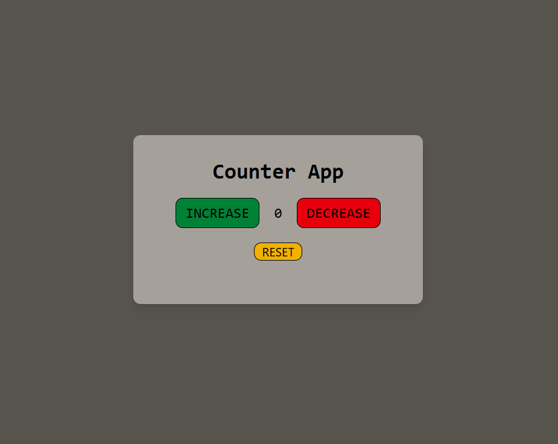

# 🔢 Counter App

A sleek and responsive Counter App built using HTML, Tailwind CSS, and JavaScript.  
This simple utility allows users to increase, decrease, and reset the counter value instantly with a clean and modern interface.

---


## 📸 Screenshot



---

## ✨ Features

- ➕ Increase counter value
- ➖ Decrease counter value
- 🔄 Reset functionality
- 🎨 Modern UI with Tailwind CSS
- ⚡ Fast and lightweight

---

## 🛠️ Technologies Used

- HTML5
- Tailwind CSS
- JavaScript

---

## ⚙️ Getting Started

Clone the repository:

```bash
git clone https://github.com/achu19desg/Counter-App.git